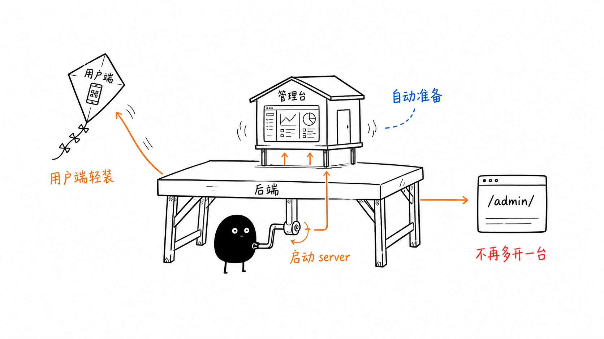

# Cyber-Pendant

Cyber-Pendant 是一个校服数字吊牌系统：用户扫码或输入 SN 码查看校服溯源信息，管理员在后台录入衣服主档、生成批次 SN 和二维码。



这个仓库现在把“用户端”和“管理台”拆开了：

- `client/` 只放用户页面，后续可以单独打包成 H5 或微信小程序。
- `server/admin/` 是独立 Vue 管理台。
- `server/` 启动后会自动准备并托管管理台，默认访问 `http://localhost:8787/admin/`。

## 你能用它做什么

- 给每件校服生成唯一 SN 码。
- 生成可印刷的二维码，扫码后进入公开吊牌详情页。
- 管理衣服主档、生产批次、颜色尺码、生产日期和执行标准。
- 查看 SN 查询次数、停用异常吊牌、真删除测试数据。
- 让家长或学生绑定学生信息，后台可查看完整绑定信息并解绑。
- 按批次导出 Excel 或 CSV 清单，方便印刷、贴标和交付。

## 快速启动

### 1. 安装后端依赖

```bash
npm --prefix server install
```

管理台依赖不需要你单独管。启动后端时，如果 `server/admin/dist` 不存在或后台源码更新了，后端会自动安装并构建管理台。

如果还要开发用户端 H5 或小程序，再安装客户端依赖：

```bash
npm --prefix client install
```

### 2. 配置环境变量

```bash
cp server/.env.example server/.env
```

首次运行前请编辑 `server/.env`，至少设置：

```env
ADMIN_PASSWORD=your-admin-password
TOKEN_SECRET=replace-with-a-long-random-secret
```

默认管理员用户名是 `admin`。

### 3. 启动后端和管理台

```bash
npm run dev
```

启动后打开：

```text
http://localhost:8787/admin/
```

第一次启动可能会多花几秒，因为后端会自动准备管理台构建产物。之后只要后台源码没变，启动会快很多。

### 4. 启动用户端 H5

用户端是独立的 uni-app 项目，开发时另开一个终端：

```bash
npm run dev:client
```

默认地址：

```text
http://localhost:5173
```

## 常用入口

| 入口 | 地址 | 说明 |
|------|------|------|
| 管理后台 | `http://localhost:8787/admin/` | 后端托管，登录后管理衣服、批次和 SN |
| API 健康检查 | `http://localhost:8787/api/health` | 确认后端是否正常运行 |
| 用户端 H5 | `http://localhost:5173` | 本地开发时的扫码/查询页面 |
| 吊牌详情 | `/#/pages/garment/detail?sn=...` | 二维码最终跳转的公开详情页 |

演示 SN：

```text
CP20260615DEMO01
```

## 推荐工作流

1. 在管理后台新增衣服主档。
2. 进入衣服详情，填写款号、颜色、尺码、批次和数量。
3. 批量生成 SN 和二维码。
4. 导出 Excel 或 CSV，交给印刷或贴标流程。
5. 用户扫码进入公开详情页，查看校服信息。
6. 如需学生身份绑定，用户在详情页提交信息，后台可查看并解绑。

## 项目结构

```text
cyber-pendant/
├── client/                    # 用户端 uni-app，面向 H5 / 微信小程序
│   ├── src/pages/index/        # SN 输入和扫码入口
│   ├── src/pages/garment/      # 公开吊牌详情页
│   ├── src/utils/api.js        # 公开查询和绑定 API
│   └── src/utils/scanner.js    # H5 / 小程序扫码适配
├── server/                    # Node.js API 服务
│   ├── admin/                  # 独立 Vue 管理台源码
│   ├── src/api.js              # HTTP 路由、API 和后台静态托管
│   ├── src/config.js           # 环境变量和路径配置
│   ├── src/db.js               # SQLite 表结构、迁移和查询
│   ├── src/index.js            # 服务入口，启动前自动准备管理台
│   ├── src/prepare-admin.js    # 管理台自动安装/构建逻辑
│   └── test/api.test.js        # 后端测试
└── data/                       # 本地 SQLite 数据库，运行时生成
```

## 架构说明

### 用户端

`client/` 只保留公开页面：

- 首页：输入 SN 或扫码。
- 吊牌详情：展示衣服信息、批次信息、二维码、查询次数和绑定状态。
- 绑定表单：提交学生姓名、学校、班级和联系电话。

用户端不包含任何后台页面和后台依赖，适合后续单独打包微信小程序。

### 管理台

`server/admin/` 是普通 Vue 3 + Vite + Vue Router 应用，路由使用 hash 模式：

```text
#/login
#/dashboard
#/clothes/:id
```

管理台构建后输出到：

```text
server/admin/dist
```

后端默认把它托管在：

```text
/admin/
```

### 后端

后端使用 Node.js 内置模块实现：

- `node:http` 提供 HTTP 服务。
- `node:sqlite` 存储数据。
- PBKDF2 保存管理员密码。
- HMAC token 做后台登录鉴权。
- `qrcode` 生成二维码图片。

后端启动时会执行 `ensureAdminBuild()`：如果管理台没安装依赖、没构建，或源码比构建产物新，就自动执行对应的 `npm install` / `npm run build`。

如确实想跳过自动构建，可设置：

```bash
ADMIN_AUTO_BUILD=0 npm run dev
# 或
SKIP_ADMIN_BUILD=1 npm run dev
```

## 数据模型

系统按三层管理吊牌数据：

| 表 | 含义 | 主要字段 |
|----|------|----------|
| `clothes` | 衣服主档 | 商品名、面料、执行标准、安全类别、等级、厂家、洗护说明、状态 |
| `garment_batches` | 生产批次 | 款号、颜色、尺码、批次标签、生产日期、批次备注、状态 |
| `garments` | SN 明细 | SN、衣服 ID、批次 ID、查询次数、绑定信息、状态 |

公开吊牌详情页会组合这三层数据展示。编辑衣服主档或批次后，已生成 SN 的公开展示会同步更新。

## 命令速查

```bash
# 后端 + 管理台
npm run dev
npm start

# 用户端
npm run dev:client
npm run build:client
npm --prefix client run build:mp-weixin

# 管理台
npm run dev:admin       # 可选：热更新开发
npm run build:admin     # 可选：手动构建

# 测试
npm test
node --test server/test/*.test.js
```

## 环境变量

### 服务端

`server/.env`：

| 变量 | 默认值 | 说明 |
|------|--------|------|
| `PORT` | `8787` | 后端监听端口 |
| `DATABASE_PATH` | `../data/cyber-pendant.sqlite` | SQLite 数据库路径 |
| `FRONTEND_BASE_URL` | `http://localhost:5173` | 用户端地址，用于生成二维码详情链接 |
| `ADMIN_BASE_PATH` | `/admin` | 后端托管管理台的访问路径 |
| `ADMIN_STATIC_DIR` | `admin/dist` | 管理台构建产物目录 |
| `CORS_ORIGIN` | `*` | CORS 允许来源 |
| `TOKEN_SECRET` | 无 | 后台 token 签名密钥，必须设置 |
| `ADMIN_USERNAME` | `admin` | 默认管理员用户名 |
| `ADMIN_PASSWORD` | 无 | 默认管理员密码，必须设置 |

### 用户端

`client/.env.local`：

| 变量 | 默认值 | 说明 |
|------|--------|------|
| `VITE_API_BASE_URL` | `http://localhost:8787` | 用户端请求的 API 地址 |

### 管理台开发

`server/admin/.env.local`，仅独立运行 `npm run dev:admin` 时需要：

| 变量 | 默认值 | 说明 |
|------|--------|------|
| `VITE_API_BASE_URL` | 空 | 为空时使用同源 `/api` |
| `VITE_FRONTEND_BASE_URL` | `http://localhost:5173` | 导出表格中的公开详情页地址 |

## API 一览

| 方法 | 路径 | 说明 | 认证 |
|------|------|------|------|
| `POST` | `/api/auth/login` | 管理员登录 | 否 |
| `GET` | `/api/clothes` | 衣服主档列表 | 是 |
| `POST` | `/api/clothes` | 新增衣服主档 | 是 |
| `GET` | `/api/clothes/{id}` | 衣服主档详情 | 是 |
| `PUT` | `/api/clothes/{id}` | 更新衣服主档 | 是 |
| `DELETE` | `/api/clothes/{id}?hard=0\|1` | 停用或真删除衣服 | 是 |
| `GET` | `/api/clothes/{id}/batches` | 衣服下的批次和 SN | 是 |
| `POST` | `/api/clothes/{id}/batches` | 创建批次并批量生成 SN | 是 |
| `PUT` | `/api/batches/{id}` | 更新或启用批次 | 是 |
| `DELETE` | `/api/batches/{id}?hard=0\|1` | 停用或真删除批次 | 是 |
| `GET` | `/api/garments` | SN 列表和筛选 | 是 |
| `POST` | `/api/garments` | 兼容旧流程：创建单个吊牌 | 是 |
| `GET` | `/api/garments/{sn}` | 公开查询吊牌详情 | 否 |
| `PUT` | `/api/garments/{sn}` | 更新 SN 状态 | 是 |
| `DELETE` | `/api/garments/{sn}?hard=0\|1` | 停用或真删除 SN | 是 |
| `POST` | `/api/garments/{sn}/binding` | 用户绑定学生信息 | 否 |
| `DELETE` | `/api/garments/{sn}/binding` | 后台解绑学生信息 | 是 |
| `POST` | `/api/sn/generate` | 生成唯一 SN | 是 |
| `GET` | `/api/qrcode/{sn}?type=sn\|url` | 获取二维码图片 | 否 |

## SN 规则

SN 格式：

```text
CP{YYYYMMDD}{6位随机字符}
```

示例：

```text
CP20260615DEMO01
```

随机字符会避开容易混淆的 `0`、`O`、`I`、`1`。

## 删除和停用

默认删除是“停用”：

- 衣服停用后，该衣服下所有 SN 扫码返回停用状态。
- 批次停用后，该批次下所有 SN 扫码返回停用状态。
- SN 停用后，公开查询返回 `423`，并带停用记录信息。

真删除使用 `?hard=1`：

- 真删除衣服会级联删除批次和 SN。
- 真删除批次会级联删除该批次下的 SN。
- 真删除 SN 后，已印刷二维码将查不到记录。

生产环境建议优先停用，谨慎真删除。

## 测试

```bash
npm test
```

测试覆盖：

- 登录鉴权和 token。
- 衣服、批次、SN 的增删改查。
- 用户公开查询和查询次数。
- 绑定、解绑和后台私密字段。
- 软删除、真删除和旧数据迁移。
- 后端托管管理台的静态文件、SPA fallback 和路径安全。

## 部署建议

1. 设置 `server/.env` 中的 `TOKEN_SECRET` 和 `ADMIN_PASSWORD`。
2. 把 `FRONTEND_BASE_URL` 配成用户端正式地址。
3. 启动后端：

```bash
npm start
```

4. 访问 `http://你的后端域名/admin/` 管理数据。
5. 将用户端 H5 或微信小程序单独发布。二维码里的详情链接由 `FRONTEND_BASE_URL` 决定。

## 许可证

查看 [LICENSE](LICENSE)。
